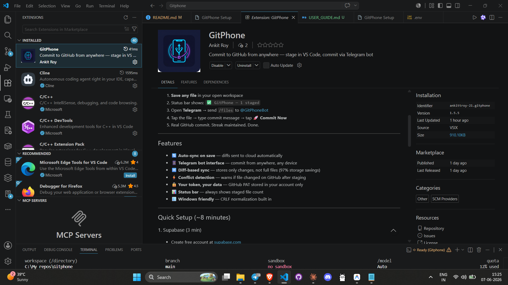
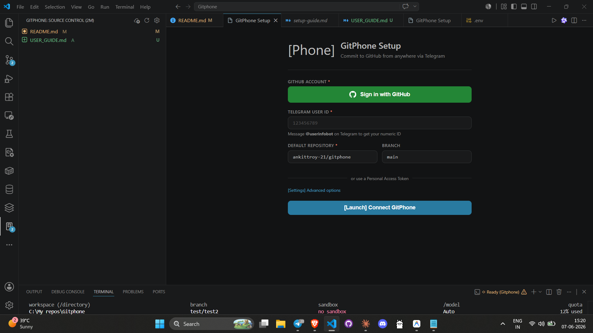
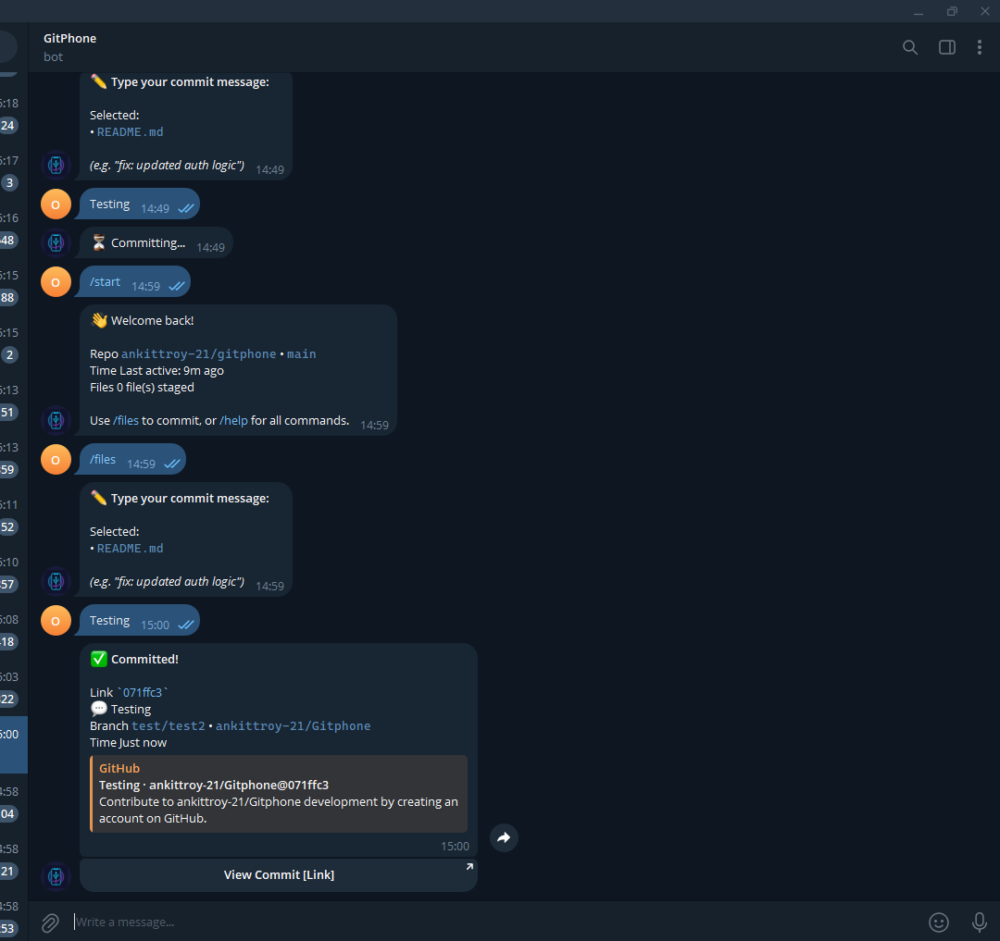

# GitPhone 📱⚡️

> **The Developer's Remote Control for GitHub.** Stage code in VS Code, commit from Telegram. Maintain your streak, even when you're away from your desk.

---

## 📽️ Visual Showcase

### The Extension

*GitPhone on the VS Code Marketplace - Seamless integration with your IDE.*

### The Setup

*Simple one-time setup: Connect your Telegram ID and your GitHub account.*

### The Bot in Action

*Commit success! Manage files, write messages, and get PR links directly in Telegram.*

---

## 🚀 The Problem & Solution

**The Problem:** Developers often have brilliant ideas or small fixes while on the move, but they can't commit them without their laptop. Maintaining a GitHub streak shouldn't require being tethered to a desk.

**The Solution:** GitPhone bridges the gap between mobile convenience and professional version control. By transforming Telegram into a powerful Git CLI, we allow developers to finalize and push their "dirty" workspace changes from anywhere.

---

## ✨ Features

- **Real-time Sync:** Every file save in VS Code is instantly synced to the cloud.
- **Single-Phase Workflow:** No complex staging. If it's modified, it's ready to sync.
- **Dynamic Branching:** Create new feature branches on the fly if `main` is protected.
- **Automatic PRs:** Get a merge link the moment you commit to a non-default branch.
- **State Reconciliation:** Manual commits in VS Code are automatically reflected in the bot.

---

## 🛠️ Tech Stack

| Component | Technology |
|---|---|
| **Bot Framework** | `python-telegram-bot` v21 (Asynchronous) |
| **Backend API** | FastAPI + Uvicorn |
| **Database** | Supabase (PostgreSQL + Real-time) |
| **GitHub Engine** | PyGithub (REST API wrapper) |
| **IDE Extension** | VS Code API + TypeScript |
| **Diff Engine** | `diff-match-patch` (Google) |

---

## 🤖 Bot Commands

| Command | Description |
|---|---|
| `/start` | Welcome & onboarding |
| `/auth` | Secure GitHub login (Device Flow) |
| `/files` | View and select staged files to commit |
| `/repo` | Show/Set active repository |
| `/branch` | Switch or create branches |
| `/preview` | See diffs of your changes |
| `/log` | View your GitPhone commit history |
| `/status` | Check connection & system health |
| `/clear` | Wipe your remote staging area |

---

## 🏗️ Technical Architecture

1.  **Extension (TypeScript):** Uses `vscode.workspace` watchers to detect changes. It computes the diff and full content, then pushes it to the FastAPI backend.
2.  **Backend (Python):** Handles authentication via GitHub Device Flow. It reconciles the local Git state with the Supabase database.
3.  **Bot (Telegram):** Provides the interactive UI for file selection and commit messaging.
4.  **GitHub Service:** Dynamically fetches the latest SHAs to prevent conflicts and executes commits via the Contents API.

---

## 🔒 Security & Privacy

- **OAuth 2.0:** We use GitHub's official Device Flow. We never see your password.
- **Isolation:** Users are strictly isolated by their unique Telegram ID.
- **BYOD (Roadmap):** Future support for "Bring Your Own Database" for enterprise privacy.

---

## 📄 Documentation
*   **[Full User Guide](USER_GUIDE.md)**
*   **[Setup & Deployment Guide](public/docs/setup-guide.md)**
*   **[Troubleshooting](public/docs/troubleshooting.md)**

